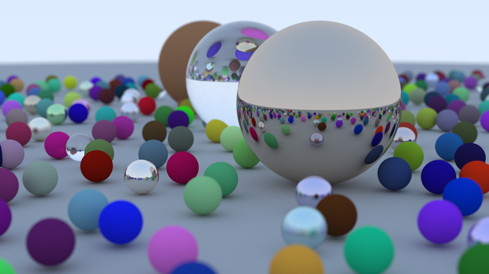
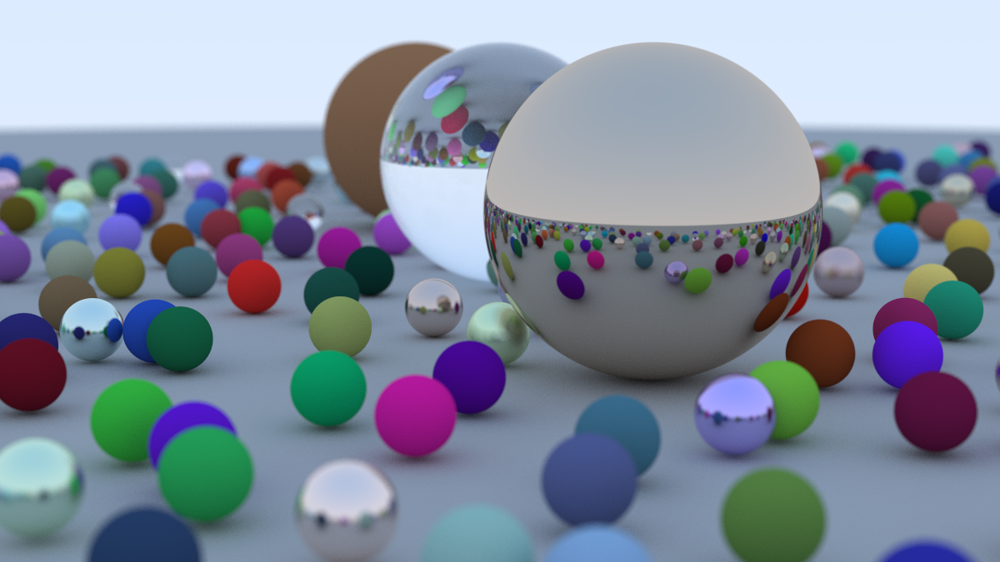

# Path Tracer

Various implementations for the final scene from
[_Ray Tracing in One Weekend_](https://raytracing.github.io/books/RayTracingInOneWeekend.html):

- [GPU Path Tracer](#gpu-path-tracer)
  - Apple's Metal API through [metal-cpp](https://developer.apple.com/metal/cpp/)
- [CPU Path Tracer](#cpu-path-tracer)
  - Built-in RTIOW C++ shading backend
  - [OSL](https://github.com/AcademySoftwareFoundation/OpenShadingLanguage)
    shading backend

## Benchmarks

Measurements used a `1200 x 675` image at 500 samples per pixel.

On an M1 MacBook Pro (8-core CPU, 8-core GPU):

| Renderer | Shading      | Parallelism     | Traversal | Time       | Speedup |
| -------- | ------------ | --------------- | --------- | ---------- | ------- |
| CPU      | Built-in C++ | Single-threaded | Linear    | 6h 06m 44s | 1x      |
| CPU      | Built-in C++ | Multithreaded   | Linear    | 53m 42s    | 6.8x    |
| CPU      | Built-in C++ | Multithreaded   | BVH       | 1m 57s     | 188x    |
| CPU      | OSL          | Multithreaded   | BVH       | 2m 27s     | 150x    |
| GPU      | Metal        | GPU-parallel    | Linear    | 2m 28s     | 149x    |

On an M5 Pro MacBook Pro (18-core CPU, 20-core GPU):

| Renderer | Shading      | Parallelism   | Traversal | Time |
| -------- | ------------ | ------------- | --------- | ---- |
| CPU      | Built-in C++ | Multithreaded | BVH       | 40s  |
| CPU      | OSL          | Multithreaded | BVH       | 42s  |
| GPU      | Metal        | GPU-parallel  | Linear    | 24s  |

See [OSL_Integration.md](docs/OSL_Integration.md) for details.

|  |  |  |
| :-------------------------------------------: | :-------------------------------: | :---------------------------------: |
|              CPU · Built-in C++               |             CPU · OSL             |             GPU · Metal             |

# GPU Path Tracer

### Requirements

The GPU renderer requires macOS and the Xcode command-line tools. `metal-cpp` is
vendored in this repository.

```bash
xcode-select --install
```

### Build

From the project root:

```bash
cmake -S . -B build/gpu -DBUILD_GPU_PT=ON -DBUILD_CPU_PT=OFF
cmake --build build/gpu
```

`BUILD_CPU_PT` defaults to `ON`, so leaving it out here would also configure
`cpu_pt` and require oneTBB.

CMake compiles `src/gpu/Shaders/*.metal` into `build/gpu/default.metallib`,
beside the executable, where the renderer looks for it.

### Run

```bash
./build/gpu/gpu_pt > output.ppm
```

# CPU Path Tracer

The CPU renderer shares its geometry, BVH, camera, and threading between two
material backends:

- `--builtin`: C++ materials modeled on the book.
- `--osl`: OSL shaders compiled to `.oso` files at build time.

OSL support is optional and adds no OSL dependencies to a built-in-only build.

### Requirements

The CPU renderer requires [oneTBB](https://github.com/uxlfoundation/oneTBB):

```bash
brew install tbb
```

The **OSL backend** also requires compatible
[OpenShadingLanguage](https://github.com/AcademySoftwareFoundation/OpenShadingLanguage)
and [OpenImageIO](https://github.com/AcademySoftwareFoundation/OpenImageIO)
installations.

### Build

For built-in shading only:

```bash
cmake -S . -B build/cpu -DBUILD_CPU_PT=ON
cmake --build build/cpu
```

To include **OSL shading**, point CMake at the OSL and OpenImageIO installations if
they are not already on its search path:

```bash
OSL_ROOT=$HOME/projects/OpenShadingLanguage/dist
OIIO_ROOT=$HOME/projects/OpenImageIO/dist

cmake -S . -B build/cpu -DBUILD_CPU_PT=ON -DENABLE_OSL=ON \
    -DCMAKE_PREFIX_PATH="$OSL_ROOT;$OIIO_ROOT"
cmake --build build/cpu
```

CMake compiles `src/cpu/osl/shaders/*.osl` into `build/cpu/shaders/*.oso`. If the
executable fails to start with a `Library not loaded` error, add the missing
library's directory with `-DPT_OSL_EXTRA_RPATHS=/path/to/lib`.

### Run

```bash
./build/cpu/cpu_pt > output.ppm
```

An OSL-enabled build defaults to `--osl`. Select a backend explicitly when
comparing the two:

```bash
./build/cpu/cpu_pt --osl     > osl.ppm
./build/cpu/cpu_pt --builtin > builtin.ppm
```

## References

- [_Ray Tracing in One Weekend_](https://raytracing.github.io/books/RayTracingInOneWeekend.html)
- [GPU Programming with the Metal Shading Language](https://www.youtube.com/watch?v=VQK28rRK6OU)
- [Accelerated Ray Tracing in One Weekend in CUDA](https://developer.nvidia.com/blog/accelerated-ray-tracing-cuda)
- [testrender](https://github.com/AcademySoftwareFoundation/OpenShadingLanguage/tree/main/src/testrender),
  OSL's reference renderer integration
